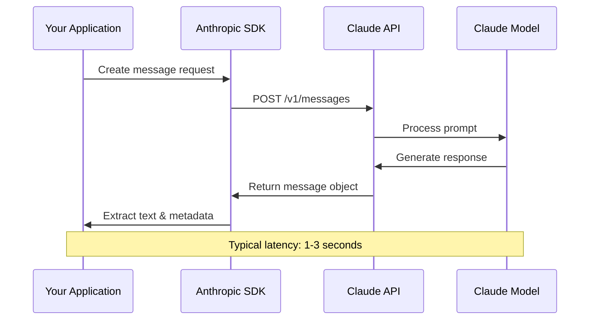
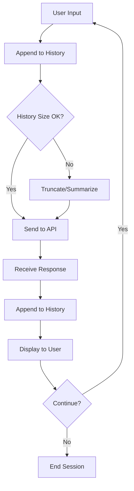
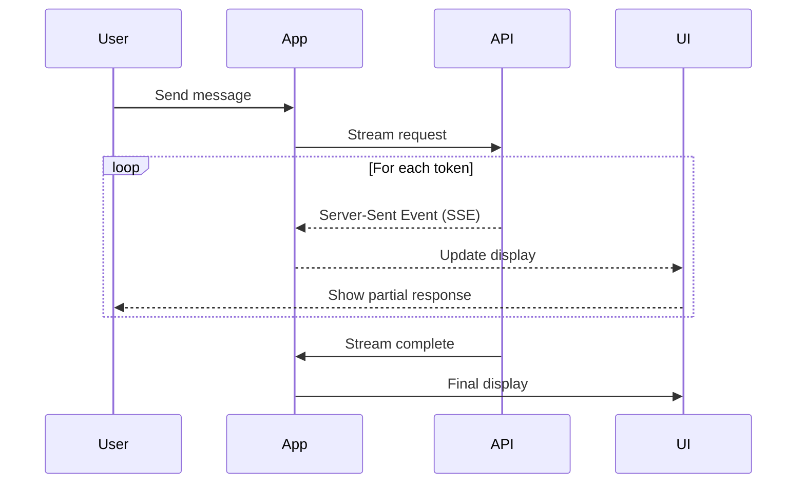

# Claude API Tutorial - Architecture & Flow Diagrams

Visual guides to help you understand the Claude API ecosystem and workflows.

## Table of Contents

- [Basic API Call Flow](#basic-api-call-flow)
- [Multi-Turn Conversation Flow](#multi-turn-conversation-flow)
- [Token Flow & Cost Calculation](#token-flow--cost-calculation)
- [Streaming Architecture](#streaming-architecture)
- [RAG Architecture](#rag-architecture)
- [Agent Architecture](#agent-architecture)
- [MCP Integration](#mcp-integration)
- [Production Deployment](#production-deployment)

---

## Basic API Call Flow

### Simple Request-Response Pattern



### ASCII Version

```
┌─────────────────┐
│  Your App       │
│  (Python/JS)    │
└────────┬────────┘
         │ 1. Create message
         │    {model, messages, ...}
         ▼
┌─────────────────┐
│ Anthropic SDK   │
│  - Validation   │
│  - Auth         │
└────────┬────────┘
         │ 2. HTTP POST
         │    /v1/messages
         ▼
┌─────────────────┐
│  Claude API     │
│  (Anthropic)    │
└────────┬────────┘
         │ 3. Process
         │    request
         ▼
┌─────────────────┐
│ Claude Model    │
│  (Haiku/Sonnet) │
└────────┬────────┘
         │ 4. Generate
         │    response
         ▼
┌─────────────────┐
│  Response       │
│  - content      │
│  - usage        │
│  - metadata     │
└─────────────────┘
```

### Code Flow (Python)

```python
# 1. Initialize client
client = Anthropic(api_key=API_KEY)

# 2. Create request
message = client.messages.create(
    model="claude-3-5-haiku-20241022",
    max_tokens=1024,
    messages=[{"role": "user", "content": "Hello!"}]
)

# 3. Extract response
text = message.content[0].text
tokens = message.usage.input_tokens + message.usage.output_tokens
```

---

## Multi-Turn Conversation Flow

### Maintaining Context



### ASCII Version with Context Management

```
Conversation Flow:
┌──────────────────────────────────────────────────────┐
│  USER INPUT: "Hi, my name is Alex"                   │
└───────────────────┬──────────────────────────────────┘
                    │
                    ▼
┌──────────────────────────────────────────────────────┐
│  CONVERSATION HISTORY                                │
│  ┌────────────────────────────────────────────────┐  │
│  │ [{"role": "user", "content": "Hi..."}]        │  │
│  └────────────────────────────────────────────────┘  │
└───────────────────┬──────────────────────────────────┘
                    │
                    ▼
┌──────────────────────────────────────────────────────┐
│  API CALL                                            │
│  • Input tokens: 15                                  │
│  • Model: claude-3-5-haiku                           │
└───────────────────┬──────────────────────────────────┘
                    │
                    ▼
┌──────────────────────────────────────────────────────┐
│  CLAUDE RESPONSE: "Hello Alex! Nice to meet you."    │
└───────────────────┬──────────────────────────────────┘
                    │
                    ▼
┌──────────────────────────────────────────────────────┐
│  UPDATE HISTORY                                      │
│  ┌────────────────────────────────────────────────┐  │
│  │ [                                              │  │
│  │   {"role": "user", "content": "Hi..."},       │  │
│  │   {"role": "assistant", "content": "Hello..."} │  │
│  │ ]                                              │  │
│  └────────────────────────────────────────────────┘  │
└──────────────────────────────────────────────────────┘
                    │
                    ▼
┌──────────────────────────────────────────────────────┐
│  NEXT TURN: "What's my name?"                        │
│  • Context includes previous messages                │
│  • Claude remembers: "Your name is Alex"             │
└──────────────────────────────────────────────────────┘
```

### Context Window Management

```
┌─────────────────────────────────────────┐
│  200K Token Context Window              │
│  ┌───────────────────────────────────┐  │
│  │ System Prompt (cached)            │  │
│  ├───────────────────────────────────┤  │
│  │ Conversation History              │  │
│  │  Message 1                        │  │
│  │  Message 2                        │  │
│  │  ...                              │  │
│  │  Message N                        │  │
│  ├───────────────────────────────────┤  │
│  │ Current User Message              │  │
│  └───────────────────────────────────┘  │
└─────────────────────────────────────────┘

Strategies when approaching limit:
1. Sliding window (keep last N messages)
2. Summarization (condense old messages)
3. Semantic pruning (keep relevant parts)
```

---

## Token Flow & Cost Calculation

### How Tokens are Counted and Charged

```
┌──────────────────────────────────────────────────────┐
│  REQUEST                                             │
│  ─────────────────────────────────────────────────   │
│  System: "You are helpful" ───────────► 4 tokens     │
│  History: [...previous...] ───────────► 150 tokens   │
│  User: "What is Python?" ─────────────► 5 tokens     │
│                                                       │
│  TOTAL INPUT: 159 tokens                             │
└───────────────────┬──────────────────────────────────┘
                    │
                    ▼
┌──────────────────────────────────────────────────────┐
│  PROCESSING                                          │
│  Claude Model generates response token by token      │
└───────────────────┬──────────────────────────────────┘
                    │
                    ▼
┌──────────────────────────────────────────────────────┐
│  RESPONSE                                            │
│  ─────────────────────────────────────────────────   │
│  "Python is a high-level..." ─────────► 85 tokens    │
│                                                       │
│  TOTAL OUTPUT: 85 tokens                             │
└──────────────────────────────────────────────────────┘

┌──────────────────────────────────────────────────────┐
│  COST CALCULATION (Haiku pricing)                    │
│  ─────────────────────────────────────────────────   │
│  Input:  159 tokens × $0.25 / 1M = $0.00003975      │
│  Output:  85 tokens × $1.25 / 1M = $0.00010625      │
│                                     ─────────────     │
│  TOTAL COST:                        $0.00014600      │
└──────────────────────────────────────────────────────┘
```

### Token Optimization Strategies

```
┌─────────────────────────────────────────────┐
│  Optimization Techniques                    │
├─────────────────────────────────────────────┤
│                                             │
│  1. Prompt Caching (Module 2)               │
│     ┌──────────────┐                        │
│     │ Cached Part  │ ◄── 90% cost reduction │
│     ├──────────────┤                        │
│     │ Dynamic Part │ ◄── Normal cost        │
│     └──────────────┘                        │
│                                             │
│  2. Streaming (Module 2)                    │
│     Response available immediately          │
│     No additional cost                      │
│                                             │
│  3. Model Selection                         │
│     Simple task  → Haiku   (cheapest)       │
│     Complex task → Sonnet  (balanced)       │
│     Expert task  → Opus    (premium)        │
│                                             │
│  4. max_tokens Limits                       │
│     Set appropriate limits                  │
│     Avoid over-generation                   │
│                                             │
└─────────────────────────────────────────────┘
```

---

## Streaming Architecture

### Real-Time Response Delivery



### ASCII Version

```
Non-Streaming (Traditional):
──────────────────────────────

User waits...        ⏳  ⏳  ⏳  ⏳  ⏳
                     (3-5 seconds)
Full response! ───────────────────────► "Here is the complete answer..."


Streaming (Modern):
───────────────────

User waits...        ⏳
Partial 1 ──────────────────► "Here"
Partial 2 ──────────────────► "Here is"
Partial 3 ──────────────────► "Here is the"
Partial 4 ──────────────────► "Here is the complete"
Complete! ───────────────────► "Here is the complete answer..."

Benefits:
✓ Better UX (immediate feedback)
✓ Perceived speed improvement
✓ Can process output as it arrives
✓ Same cost as non-streaming
```

### Implementation Pattern

```python
# Streaming
with client.messages.stream(...) as stream:
    for text in stream.text_stream:
        print(text, end="", flush=True)
        # Process token immediately!
```

---

## RAG Architecture (Module 4)

### Retrieval-Augmented Generation Flow

```
┌─────────────┐
│ User Query  │
│"What is X?" │
└──────┬──────┘
       │
       ▼
┌──────────────────────────────────────┐
│  1. Query Embedding                  │
│  ┌────────────────────────────────┐  │
│  │ Vector: [0.1, 0.3, 0.5, ...]  │  │
│  └────────────────────────────────┘  │
└──────────────┬───────────────────────┘
               │
               ▼
┌──────────────────────────────────────┐
│  2. Vector Database Search           │
│  ┌────────────────────────────────┐  │
│  │ Query vector                   │  │
│  │      vs                        │  │
│  │ Document vectors               │  │
│  └────────────────────────────────┘  │
└──────────────┬───────────────────────┘
               │
               ▼
┌──────────────────────────────────────┐
│  3. Retrieve Top K Documents         │
│  ┌────────────────────────────────┐  │
│  │ Doc 1 (score: 0.92)            │  │
│  │ Doc 2 (score: 0.87)            │  │
│  │ Doc 3 (score: 0.81)            │  │
│  └────────────────────────────────┘  │
└──────────────┬───────────────────────┘
               │
               ▼
┌──────────────────────────────────────┐
│  4. Construct Prompt                 │
│  ┌────────────────────────────────┐  │
│  │ System: Use these docs...      │  │
│  │ Documents: [Doc1, Doc2, Doc3]  │  │
│  │ Question: What is X?           │  │
│  └────────────────────────────────┘  │
└──────────────┬───────────────────────┘
               │
               ▼
┌──────────────────────────────────────┐
│  5. Send to Claude API               │
│  ┌────────────────────────────────┐  │
│  │ Claude reads documents         │  │
│  │ Claude answers question        │  │
│  └────────────────────────────────┘  │
└──────────────┬───────────────────────┘
               │
               ▼
┌──────────────────────────────────────┐
│  6. Answer with Citations            │
│  "Based on Document 1, X is..."      │
└──────────────────────────────────────┘
```

---

## Agent Architecture (Module 7)

### ReAct Agent Pattern (Reasoning + Action)

```
┌────────────────────────────────────────────────────┐
│  Agent Loop                                        │
│                                                    │
│  ┌──────────────┐                                 │
│  │  User Task   │                                 │
│  └──────┬───────┘                                 │
│         │                                         │
│         ▼                                         │
│  ┌──────────────┐                                │
│  │   Thought    │ "I need to search for info"    │
│  └──────┬───────┘                                │
│         │                                         │
│         ▼                                         │
│  ┌──────────────┐                                │
│  │   Action     │ use_tool("search", "query")    │
│  └──────┬───────┘                                │
│         │                                         │
│         ▼                                         │
│  ┌──────────────┐                                │
│  │ Observation  │ [Search results...]            │
│  └──────┬───────┘                                │
│         │                                         │
│         ▼                                         │
│  ┌──────────────┐                                │
│  │   Thought    │ "Now I can answer"             │
│  └──────┬───────┘                                │
│         │                                         │
│         ▼                                         │
│  ┌──────────────┐                                │
│  │   Answer     │ Final response                 │
│  └──────────────┘                                │
└────────────────────────────────────────────────────┘
```

### Multi-Agent System

```
                    ┌────────────────┐
                    │  Orchestrator  │
                    │     Agent      │
                    └────────┬───────┘
                             │
           ┌─────────────────┼─────────────────┐
           │                 │                 │
           ▼                 ▼                 ▼
    ┌──────────┐      ┌──────────┐     ┌──────────┐
    │ Research │      │  Writer  │     │ Reviewer │
    │  Agent   │      │  Agent   │     │  Agent   │
    └──────────┘      └──────────┘     └──────────┘
         │                  │                 │
         │ Find info        │ Draft text      │ Check quality
         ▼                  ▼                 ▼
    ┌──────────────────────────────────────────────┐
    │          Shared Memory / Context             │
    └──────────────────────────────────────────────┘
```

---

## MCP Integration (Module 5)

### Model Context Protocol Architecture

```
┌──────────────────┐
│  Claude Desktop  │
│  or Your App     │
└────────┬─────────┘
         │ MCP Protocol
         ▼
┌──────────────────┐
│  MCP Client      │
│  (Built-in SDK)  │
└────────┬─────────┘
         │
         ├──────────────────────────────────┐
         │                                  │
         ▼                                  ▼
┌──────────────────┐            ┌──────────────────┐
│  MCP Server 1    │            │  MCP Server 2    │
│  (Filesystem)    │            │  (GitHub API)    │
├──────────────────┤            ├──────────────────┤
│ Tools:           │            │ Tools:           │
│  - read_file     │            │  - create_issue  │
│  - write_file    │            │  - search_repos  │
│  - list_dir      │            │  - get_pr        │
├──────────────────┤            ├──────────────────┤
│ Resources:       │            │ Resources:       │
│  - file://...    │            │  - github://...  │
└──────────────────┘            └──────────────────┘
```

---

## Production Deployment (Module 8)

### Complete Production Architecture

```
┌────────────────────────────────────────────────────┐
│  Frontend (User Interface)                         │
│  ┌──────────┐  ┌──────────┐  ┌──────────┐        │
│  │ Web App  │  │  Mobile  │  │   CLI    │        │
│  └────┬─────┘  └────┬─────┘  └────┬─────┘        │
└───────┼─────────────┼─────────────┼───────────────┘
        │             │             │
        └──────────── ┼ ────────────┘
                      │
                      ▼
┌────────────────────────────────────────────────────┐
│  Load Balancer / API Gateway                       │
└────────────────────┬───────────────────────────────┘
                     │
        ┌────────────┼────────────┐
        │            │            │
        ▼            ▼            ▼
┌───────────┐ ┌───────────┐ ┌───────────┐
│  Server 1 │ │  Server 2 │ │  Server 3 │
│           │ │           │ │           │
│  App      │ │  App      │ │  App      │
│  Logic    │ │  Logic    │ │  Logic    │
└─────┬─────┘ └─────┬─────┘ └─────┬─────┘
      │             │             │
      └─────────────┼─────────────┘
                    │
        ┌───────────┼───────────────────┐
        │           │                   │
        ▼           ▼                   ▼
┌──────────┐  ┌──────────┐      ┌──────────┐
│  Cache   │  │ Database │      │  Queue   │
│  (Redis) │  │ (Postgres│      │ (RabbitMQ)│
└──────────┘  │  /Mongo) │      └──────────┘
              └──────────┘
                    │
                    ▼
        ┌───────────────────────┐
        │  External Services    │
        ├───────────────────────┤
        │ • Claude API          │
        │ • Vector DB (Pinecone)│
        │ • Monitoring (Datadog)│
        │ • Logging (ELK Stack) │
        └───────────────────────┘
```

### Request Flow with Error Handling

```
Request Flow:
─────────────

User Request
     │
     ▼
┌─────────────┐
│ Rate Limit  │──► 429: Too Many Requests
│   Check     │
└──────┬──────┘
       │
       ▼
┌─────────────┐
│   Auth      │──► 401: Unauthorized
│   Check     │
└──────┬──────┘
       │
       ▼
┌─────────────┐
│  Validate   │──► 400: Bad Request
│   Input     │
└──────┬──────┘
       │
       ▼
┌─────────────┐
│   Cache     │──► Cache Hit: Return cached response
│   Check     │──► Cache Miss: Continue
└──────┬──────┘
       │
       ▼
┌─────────────┐
│  Claude API │──► Retry on 5xx errors (3 attempts)
│    Call     │──► Exponential backoff
└──────┬──────┘
       │
       ▼
┌─────────────┐
│   Process   │
│  Response   │
└──────┬──────┘
       │
       ▼
┌─────────────┐
│    Cache    │
│   Result    │
└──────┬──────┘
       │
       ▼
┌─────────────┐
│    Log      │
│  Metrics    │
└──────┬──────┘
       │
       ▼
   Return 200 OK
```

---

## Quick Reference

### API Endpoint Overview

```
Base URL: https://api.anthropic.com/v1

Endpoints:
┌────────────────────────────────────────────┐
│ POST /messages                             │
│   • Create a message                       │
│   • Request body: model, messages, etc.    │
│   • Response: content, usage, id           │
└────────────────────────────────────────────┘
┌────────────────────────────────────────────┐
│ POST /messages (stream=true)               │
│   • Same as above but streaming            │
│   • Response: Server-Sent Events (SSE)     │
└────────────────────────────────────────────┘
```

### Model Selection Decision Tree

```
                Start
                  │
                  ▼
            ┌───────────┐
            │ Task Type?│
            └─────┬─────┘
                  │
      ┌───────────┼───────────┐
      │           │           │
      ▼           ▼           ▼
 ┌────────┐  ┌────────┐  ┌────────┐
 │ Simple │  │Complex │  │Expert  │
 │  Task  │  │ Task   │  │ Task   │
 └───┬────┘  └───┬────┘  └───┬────┘
     │           │           │
     ▼           ▼           ▼
 ┌────────┐  ┌────────┐  ┌────────┐
 │ Haiku  │  │Sonnet  │  │ Opus   │
 │ $      │  │ $$     │  │ $$$    │
 │ Fast   │  │Medium  │  │ Slow   │
 └────────┘  └────────┘  └────────┘
```

---

These diagrams serve as visual guides throughout the tutorial. Refer back to them as you progress through the modules!
